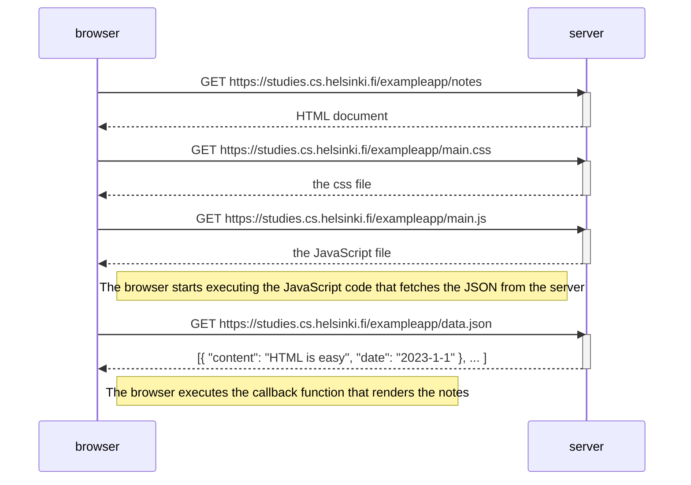
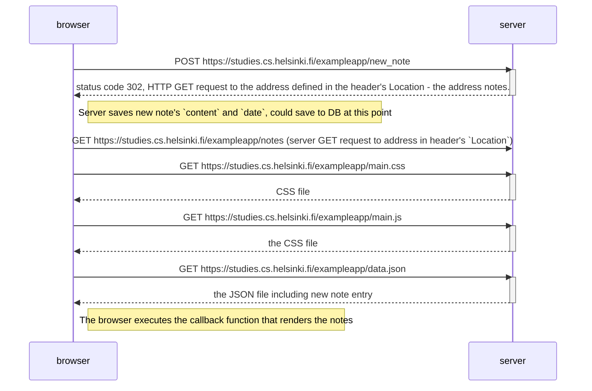

# Part 0: Basic JavaScript Webpage Diagrams

The below sequence diagrams were created using Mermaid-syntax in a GitHub .md file. 

### Loading / Rendering a traditional JavaScript webpage

* The browser fetches the HTML code defining the content and the structure of the page from the server using an HTTP GET request.
* Links in the HTML code cause the browser to also fetch the CSS style sheet main.css...
...and the JavaScript code file main.js
* The browser executes the JavaScript code. The code makes an HTTP GET request to the address https://studies.cs.helsinki.fi/exampleapp/data.json, which returns the notes as JSON data.
* When the data has been fetched, the browser executes an event handler, which renders the notes to the page using the DOM-API.

### New Note Creation (basic JavaScript web app)

* The browser fetches the HTML code defining the content and the structure of the page from the server using an HTTP GET request.
* The server throws a status code 302 and requets the browser to fetch the notes address defined in the header's `Location`
* The browser fetches the requested notes file
* Links in the HTML code cause the browser to also fetch the CSS style sheet main.css...
...and the JavaScript code file main.js
* The browser executes the JavaScript code. The code makes an HTTP GET request to the address https://studies.cs.helsinki.fi/exampleapp/data.json, which returns the notes as JSON data.
* When the data has been fetched, the browser executes an event handler, which renders the notes to the page using the DOM-API.

### Loading / Rendering a Single Page Application
